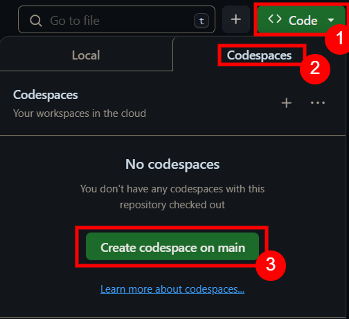
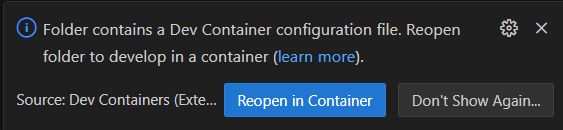

# DevContainer Settings for CS6601 Spring 2024

If you like coding in [VisualStudio Code](https://visualstudio.com/), and you don't enjoy setting up development environments, this repository is for you.

The main benefit is that you will be able to run on a virtual machine.

### Notes
- If you don't wish to use _Visual Studio Code_, then this repo isn't for you.
- In compliance with the university's policy, this does not contain any code, or psudeocode only configuration files.

### Three ways of running DevContainers [DevContainers](https://code.visualstudio.com/docs/devcontainers/containers)
- Locally, requires Docker
- From your browser using [GitHub Codespaces](https://github.com/features/codespaces), which maybe [free for students](https://learn.microsoft.com/en-us/training/student-hub/github-codespaces-for-students)
- Hybrid: which means you're running a local editor but the code is running on the cloud

### What's included:
- `/devcontainer/.devcontainer` settings file, which tells your environment how to be configured. 
- `requirements.txt` which installs the Python packages per CS6601 specifications

### Launching from your browser

### Running Locally
- clone the repo, and open the folder in vscode. You should see a message asking you whether you want to "reopen in container"
